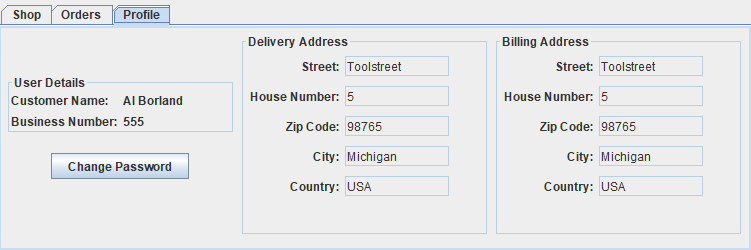
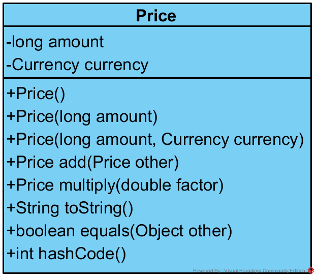

# Week 4 Exercise

In these exercises you will look for and apply the patterns of the lecture to the B2B-tec software. You will:
- Analyze the graphical user interface and identify the composite pattern
- Implement a visitor for the catalog
- Implement a value type to represent prices


## Composite Pattern
A typical application of the composite pattern are graphical user interfaces. B2B-tec features a Java Swing-based user interface that also applies that pattern to compose its elements. While this applies to the whole interface we focus on the *Profile* tab in the main view as an example.



The main panel of the *Profile* tab is specified by the `ProfileTabBase` class. This class contains mostly code generated by the WindowBuilder. This it is not structured nicely and everything is implemented in the constructor. For this task you can ignore all layout-related variables and types, like `GridBagLayout` and `GridBagConstraints`.

### a) Standalone
- Analyze the following classes of the AWT framework. Draw them in a class diagram. 
  - `Component` (`java.awt`)
  - `Container` (`java.awt`)
  - `Canvas` (`java.awt`)

- Identify the composite pattern in the class diagram
  - Which type is the *Composite*?
  - Which type is the *Component*?
  - Which type is a *Leaf*?

- Omit attributes and operations of the types
  - You can use Eclipse’s Type Hierarchy View to better see the inheritance structure in those classes. It can be shown for a selected type with the *F4* key.


### b) In *B2B-tec* (Optional)

- Draw a class diagram containing the following classes of the AWT/Swing framework and the B2B-tec application:
  - `Component` (AWT)
  - `Container` (AWT)
  - `JComponent` (Swing)
  - `JLabel` (Swing)
  - `AbstractButton` (Swing)
  - `JButton` (Swing)
  - `JPanel` (Swing)
  - `AddressPanelBase` (B2B-tec)
  - `AddressPanel` (B2B-tec)
  - Omit attributes and operations of the types
  - You can use Eclipse’s Type Hierarchy View to better see the inheritance structure in those classes. It can be shown for a selected type with the *F4* key.

- Identify the composite pattern in the class diagram
  - Which type is the *Composite*?
  - Which type is the *Component*?
  - Are there any *Leaf* types?
- Draw an object diagram of an instance of the `ProfileTabBase` type. As mentioned above, ignore the layout types for this task and focus only on the objects directly created in `ProfileTabBase`'s constructor.


## Visitor Pattern

The visitor pattern can be applied when functionality has to be added to class hierarchies. We have introduced such a hierarchy in the **B2B-tec** product catalog. The catalog consists of `Product`s, `Category`s and the `Catalog` itself. For this exercise we introduced the `CatalogItem` interface, which features an `accept(CatalogItemVisitor)` method. 

```Java
public interface CatalogItem {
  void accept(CatalogItemVisitor visitor);
}
```

The `CatalogItem` and the classes implementing it, form a hierarchical structure, similar to the *Composite* pattern. In this example we deliberately avoided realzing the hierarchy with the *Composite* pattern. While it is not necessary to have it to apply the *Visitor* it is not uncommon that both patterns appear together. 


- Study the `CatalogItemVisitor` interface, which is located in the `ch.b2btec.bl.visitor` package. It features a visit method for each type. It also contains a variation of the visitor pattern. In addition to the visitor method it also contains a leave method for each type. This is used to signal the end of an object in a hierarchical structure.

```Java
public interface CatalogItemVisitor {

	void visit(Catalog catalog);
	void leave(Catalog catalog);

	void visit(Product product);
	void leave(Product product);

	void visit(Category category);
	void leave(Category category);
}
```

- Study the implementation of the accept methods in the implementing classes (`Catalog`, `Category` and `Product`).

### Your Task
- Implement the `CatalogPrintVisitor`. Its purpose is to print a given catalog, and all its categories as well as the contained products.
  - For a Catalog only the caption "Catalog" should be printed
  - For a Product its name together with its cost should be printed
  - For a Category the caption "Category: " followed by the category name is printed
  - Catalogs and categories have child elements. For each level an indentation of one tab character should be printed before the element

```
Catalog
  Eraser costs 3$
  Category: Writing Materials
    Pen costs 2$
    Pencil costs 1$
    Category: Brushes
      Frog Hair Brush costs 10$
    Category: Paper
      Sheet of Paper costs 1$
```

- The scaffolding of the class `CatalogPrintVisitor` is already given. Your implementation is only there.
- Run the `CatalogPrintVisitorTests` to see if your implementation is correct.
- Start by getting the first test green and the continue with the next failing test.


## Value Object Pattern
A few classes of the *B2B-tec* application have a price property or a method calculating a price. For example each `Product` has a price and the total cost of a shopping cart is a price as well. Currently, such a price is represented by an `int`. This leads to some problems:
- An `int` does not have a dimension. In the case of a price, the dimension would be the currency. From the `int` type it is not possible to specify the decimal digits that might be required for currencies. The whole implementation requires to feature the same understanding of how the `int` type represents a price.

```Java
mugs.addProduct(createProduct("Espresso Cup", 15, "Holds a little coffee", "Volume 0.5dl"));
//How much does the cup actually cost? 15 Cents? 15 Dollars? 15 Euros?
```

- The `int` can represent negative values, which might be an invalid value for price per se. Subsequently, we need additional logic and tests in the `Product` type to prevent creation of negative priced items.

```Java
private void checkPrice(int price) {
  if (price < 0) {
    throw new IllegalArgumentException("Product price cannot be below zero");
  }
}
```

### Your Task
- Implement a value type `Price` to represent prices in the *B2B-tec* application
- A price consists of an `amount` and a `currency`
- A currency is a value object itself. Fortunately, Java already features `java.util.Currency`, which can be used
- You can solve this exercise either in the context of a standalone project provided [here](week%204%20Price%20Value%20Type%20Exercise) or directly in the *B2B-tec* project.
- The scaffolding for the `Price` class is already present either ` or in `ch.b2btec.bl.Price` (*B2B-tec*).
- We have prepared test cases for the `Price` class also in the default package (standalone project) or in `ch.b2btec.bl.tests.PriceTests` (*B2B-tec*).

***Note:*** The locations to add code are marked by a `TODO: 4.2` comment.



API of `Price`:
- `Price()`: which should initialize the `amount` with `0` and use *CHF* as currency
- `Price(long amount)`: which initializes the `amount` to `amount` and uses *CHF* as currency
- `Price(long amount, Currency currency)`: which initializes the `amount` to `amount` and `currency` to `currency`
- `Price add(Price other)`: Adds two Prices by creating a new one. `this` and other are not changed.
- `Price multiply(double factor)`: Multiplies a `Price` by a `factor` by creating a new `Price`. `this` is not changed
- `String toString()`: Creates a nice `String` for the `Price`. E.g: `"CHF 149.95"`
- `boolean equals(Other other)`: Returns true if two `Price`s are equal (same `amount` and `currency`)
- `int hashCode()`: Should be the same for two `Price`s that are also equal. Hash codes are tricky to get correct, as they need to make sure to avoid collisions.
- Further restriction: A `Price` should never be negative. If a negative `Price` would be created throw an `IllegalArgumentException` instead.

#### In *B2B-tec* only (Optional)
After you have implemented the `Price` type, use it where appropriate in the *B2B-tec* application. This will primarily affect the `Product` class in our Business Domain. You will notice that changing a class in the core of your application the effect will ripple through many other components depending on it:
- Primarily the tests for the changed type will change
- The user interface might be affected as well

***Important:*** Be aware that if you change `Product` you have to update and rerun the `HardcodedCatalogBuilder`. Otherwise you will get strange exceptions by the JSON parser.


