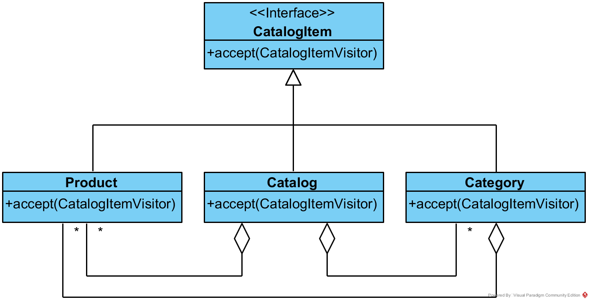

# Week 4 Exercise

In these exercises you will look for and apply the patterns of the lecture to the B2B-tec software. You will:
- Analyze the graphical user interface and identify the composite pattern
- Implement a visitor for the catalog
- Implement a value type to represent prices


## Composite Pattern

A typical application of the composite pattern are graphical user interfaces. B2B-tec features a Java Swing-based user interface that also applies that pattern to compose its elements. While this applies to the whole interface we focus on the *Profile* tab in the main view as an example.


The main panel of the *Profile* tab is specified by the `ProfileTabBase` class. This class contains mostly code generated by the WindowBuilder. This it is not structured nicely and everything is implemented in the constructor. For this task you can ignore all layout-related variables and types, like `GridBagLayout` and `GridBagConstraints`.

### Your Task

- Draw a class diagram containing the following classes of the AWT/Swing framework and the B2B-tec application:
  - `Component` (AWT)
  - `Container` (AWT)
  - `JComponent` (Swing)
  - `JLabel` (Swing)
  - `AbstractButton` (Swing)
  - `JButton` (Swing)
  - `JPanel` (Swing)
  - `AddressPanelBase` (B2B-tec)
  - `AddressPanel` (B2B-tec)
  - Omit attributes and operations of the types
  - You can use Eclipse’s Type Hierarchy View to better see the inheritance structure in those classes. It can be shown for a selected type with the *F4* key.

- Identify the composite pattern in the class diagram
  - Which type is the *Composite*?
  - Which type is the *Component*?
  - Are there any *Leaf* types?
- Draw an object diagram of an instance of the `ProfileTabBase` type. As mentioned above, ignore the layout types for this task and focus only on the objects directly created in `ProfileTabBase`'s constructor.


## Visitor Pattern

The visitor pattern can be applied when functionality has to be added to class hierarchies. We have introduced such a hierarchy in the **B2B-tec** product catalog. The catalog consists of `Product`s, `Category`s and the `Catalog` itself. For this exercise we introduced the `CatalogItem` interface, which features an `accept(CatalogItemVisitor)` method. 

```Java
public interface CatalogItem {
  void accept(CatalogItemVisitor visitor);
}
```

You should recognize that this is again the *Composite* pattern. While it is not necessary to have it to apply the *Visitor* it is not uncommon that both appear together.




- Study the `CatalogItemVisitor` interface, which is located in the `ch.b2btec.bl.visitor` package. It features a visit method for each type. It also contains a variation of the visitor pattern. In addition to the visitor method it also contains a leave method for each type. This is used to signal the end of an object in a hierarchical structure.

```Java
public interface CatalogItemVisitor {

	void visit(Catalog catalog);
	void leave(Catalog catalog);

	void visit(Product product);
	void leave(Product product);

	void visit(Category category);
	void leave(Category category);
}
```

- Study the implementation of the accept methods in the implementing classes (`Catalog`, `Category` and `Product`).

### Your Task
- Implement the `CatalogPrintVisitor`. Its purpose is to print a given catalog, and all its categories as well as the contained products.
  - For a Catalog only the caption "Catalog" should be printed
  - For a Product its name together with its cost should be printed
  - For a Category the caption "Category: " followed by the category name is printed
  - Catalogs and categories have child elements. For each level an indentation of one tab character should be printed before the element

```
Catalog
  Eraser costs 3$
  Category: Writing Materials
    Pen costs 2$
    Pencil costs 1$
    Category: Brushes
      Frog Hair Brush costs 10$
    Category: Paper
      Sheet of Paper costs 1$
```

- The scaffolding of the class `CatalogPrintVisitor` is already given. Your implementation is only there.
- Run the `CatalogPrintVisitorTests` to see if your implementation is correct.
- Start by getting the first test green and the continue with the next failing test.
